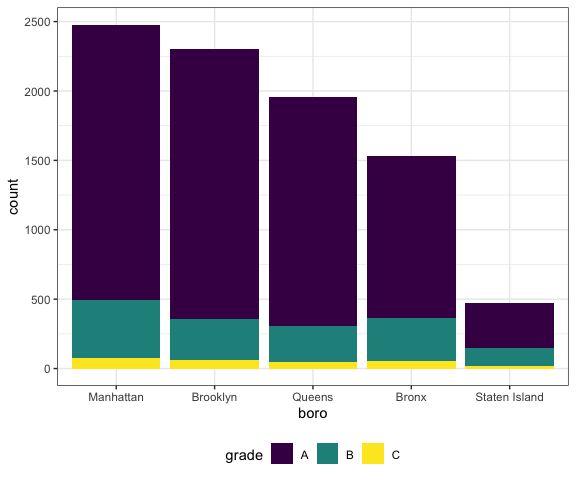

Strings & Factors
================
Derek Lamb
2023-10-17

``` r
library(tidyverse)
library(rvest)
library(p8105.datasets)

knitr::opts_chunk$set(
  fig.width = 6,
  out.width = "90%"
)

## These are options that i'm going to treat as default for now
## I don't love viridis, but don't have a better option yet
theme_set(theme_bw() + theme(legend.position = "bottom"))

options(
  ggplot2.continuous.colour = "viridis",
  ggplot2.continuous.fill = "viridis"
)

scale_colour_discrete = scale_colour_viridis_d
scale_fill_discrete = scale_fill_viridis_d
```

## Strings and manipulation

``` r
vec_str <- c("my","name","is","derek")

#look for specific sets, case sensitive
str_detect(vec_str, "derek")
```

    ## [1] FALSE FALSE FALSE  TRUE

``` r
str_detect(vec_str, "e")
```

    ## [1] FALSE  TRUE FALSE  TRUE

``` r
str_detect(vec_str, "Name")
```

    ## [1] FALSE FALSE FALSE FALSE

``` r
#replace parts of string
str_replace(vec_str, "derek", "Derek")
```

    ## [1] "my"    "name"  "is"    "Derek"

``` r
str_replace(vec_str, "e", "E")
```

    ## [1] "my"    "namE"  "is"    "dErek"

``` r
vec_str = c(
  "i think we all rule for participating",
  "i think i have been caught",
  "i think this will be quite fun actually",
  "it will be fun, i think"
  )

# first character ^, last character $
str_detect(vec_str, "i think")
```

    ## [1] TRUE TRUE TRUE TRUE

``` r
str_detect(vec_str, "^i think")
```

    ## [1]  TRUE  TRUE  TRUE FALSE

``` r
str_detect(vec_str, "i think$")
```

    ## [1] FALSE FALSE FALSE  TRUE

``` r
vec_str = c(
  "Time for a Pumpkin Spice Latte!",
  "went to the #pumpkinpatch last weekend",
  "Pumpkin Pie is obviously the best pie",
  "SMASHING PUMPKINS -- LIVE IN CONCERT!!"
  )

str_detect(vec_str, "pumpkin")
```

    ## [1] FALSE  TRUE FALSE FALSE

``` r
str_detect(vec_str, "[Pp]umpkin")
```

    ## [1]  TRUE  TRUE  TRUE FALSE

``` r
vec_str = c(
  '7th inning stretch',
  '1st half soon to begin. Texas won the toss.',
  'she is 5 feet 4 inches tall',
  '3AM - cant sleep :('
  )

str_detect(vec_str, "[0-9]")
```

    ## [1] TRUE TRUE TRUE TRUE

``` r
str_detect(vec_str, "^[0-9]")
```

    ## [1]  TRUE  TRUE FALSE  TRUE

``` r
str_detect(vec_str, "^[0-9][a-z]")
```

    ## [1]  TRUE  TRUE FALSE FALSE

``` r
vec_str = c(
  'Its 7:11 in the evening',
  'want to go to 7-11?',
  'my flight is AA711',
  'NetBios: scanning ip 203.167.114.66'
  )

# a . is a placeholder for anything, \\ is special character
str_detect(vec_str, "7.11")
```

    ## [1]  TRUE  TRUE FALSE  TRUE

``` r
str_detect(vec_str, "\\.")
```

    ## [1] FALSE FALSE FALSE  TRUE

``` r
vec_str = c(
  'The CI is [2, 5]',
  ':-]',
  ':-[',
  'I found the answer on pages [6-7]'
  )

str_detect(vec_str, "\\[")
```

    ## [1]  TRUE FALSE  TRUE  TRUE

``` r
str_detect(vec_str, "\\[[0-9]")
```

    ## [1]  TRUE FALSE FALSE  TRUE

## Factors

``` r
vec_sex =factor(c("male", "male", "female", "female"))
vec_sex
```

    ## [1] male   male   female female
    ## Levels: female male

``` r
as.numeric(vec_sex)
```

    ## [1] 2 2 1 1

``` r
vec_sex = fct_relevel(vec_sex, "male")
vec_sex
```

    ## [1] male   male   female female
    ## Levels: male female

``` r
as.numeric(vec_sex)
```

    ## [1] 1 1 2 2

## NSDUH again

``` r
nsduh_url = "http://samhda.s3-us-gov-west-1.amazonaws.com/s3fs-public/field-uploads/2k15StateFiles/NSDUHsaeShortTermCHG2015.htm"

table_marj = 
  read_html(nsduh_url) |> 
  html_table() |> 
  first() |> 
  slice(-1)
```

Need to tidy this df. Deal with columns, convert to long form

``` r
df_marj = table_marj |> 
  select(-contains("P Value")) |> 
  pivot_longer(-State,
    names_to = "age_year",
    values_to = "percent") |> 
  separate(
    age_year, 
    into = c("age", "year"), 
    "\\(" ) |> 
  mutate(year = str_remove(year, "\\)"),
         percent = str_remove(percent, "[a-b]"),
         percent = as.numeric(percent)) |> 
  filter(!State %in% c("Total U.S.", "Northeast", "Midwest", "South", "West"))
```

Make a plot

``` r
df_marj |> 
  filter(age == "18-25") |> 
  mutate(State = fct_reorder(State, percent)) |> 
  ggplot(aes(x = State, y = percent, color = year)) +
  geom_point() +
#rotate text and align
  theme(axis.text.x = element_text(angle = 90, vjust =0.5, hjust =1))
```


## Res inspect

``` r
data("rest_inspec") 
```

``` r
rest_inspec |> 
  count(boro, grade) |> 
  pivot_wider(names_from = grade, values_from = n) |> 
  knitr::kable()
```

| boro          |     A |     B |    C | Not Yet Graded |   P |    Z |    NA |
|:--------------|------:|------:|-----:|---------------:|----:|-----:|------:|
| BRONX         | 13688 |  2801 |  701 |            200 | 163 |  351 | 16833 |
| BROOKLYN      | 37449 |  6651 | 1684 |            702 | 416 |  977 | 51930 |
| MANHATTAN     | 61608 | 10532 | 2689 |            765 | 508 | 1237 | 80615 |
| Missing       |     4 |    NA |   NA |             NA |  NA |   NA |    13 |
| QUEENS        | 35952 |  6492 | 1593 |            604 | 331 |  913 | 45816 |
| STATEN ISLAND |  5215 |   933 |  207 |             85 |  47 |  149 |  6730 |

``` r
df_inspec <- 
  rest_inspec |> 
  filter(grade %in% c("A", "B", "C", boro !="Missing")) |> 
  mutate(boro = str_to_title(boro),
         dba = str_to_upper(dba))
```

``` r
df_inspec |> 
  filter(str_detect(dba, "PIZZA")) |> 
  count(boro)
```

    ## # A tibble: 5 × 2
    ##   boro              n
    ##   <chr>         <int>
    ## 1 Bronx          1531
    ## 2 Brooklyn       2305
    ## 3 Manhattan      2479
    ## 4 Queens         1954
    ## 5 Staten Island   471

``` r
df_inspec |> 
  filter(str_detect(dba, "PIZZA")) |> 
  mutate(boro = fct_infreq(boro)) |> 
  ggplot(aes(x = boro, fill = grade)) +
  geom_bar()
```



``` r
df_inspec |> 
  filter(str_detect(dba, "PIZZA")) |> 
  mutate(boro = fct_infreq(boro),
         boro = fct_recode(boro, "The City" = "Manhattan")) |> 
  ggplot(aes(x = boro, fill = grade)) +
  geom_bar()
```


